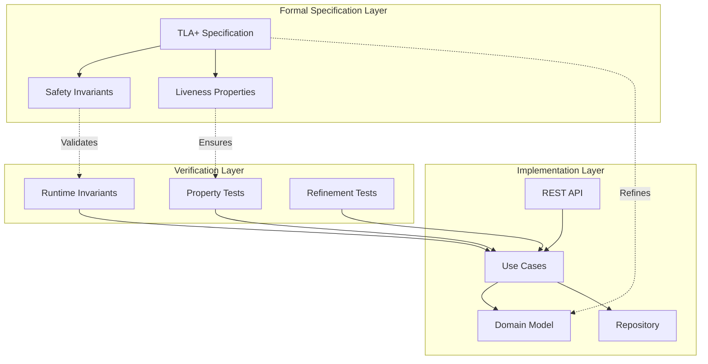

# Task Management System - Formally Verified with TLA+

[](https://github.com/bhatti/sample-task-management/actions)
[](./TaskManagementImproved.tla)
[](https://goreportcard.com/report/github.com/bhatti/sample-task-management)
[](https://codecov.io/gh/bhatti/sample-task-management)
[](https://opensource.org/licenses/MIT)

A sample task management system with mathematical correctness guarantees, built using TLA+ formal specifications and implemented in Go with property-based testing.

## 🌟 Key Features

- **Formally Verified**: Complete TLA+ specification with proven safety and liveness properties
- **Property-Based Testing**: Automated verification that implementation matches specification
- **Runtime Invariant Checking**: Continuous correctness validation 
- **Dependency Management**: Automatic task blocking/unblocking with cycle detection
- **Priority Inheritance**: Critical tasks escalate their dependencies
- **Session Management**: Secure multi-user authentication with session handling
- **Bulk Operations**: Efficient batch status updates
- **RESTful API**: Clean HTTP interface following REST principles

## 📚 Table of Contents

- [Architecture Overview](#-architecture-overview)
- [Why Formal Verification?](#-why-formal-verification)
- [Quick Start](#-quick-start)
- [Project Structure](#-project-structure)
- [TLA+ Specification](#-tla-specification)
- [Implementation Design](#-implementation-design)
- [Property-Based Testing](#-property-based-testing)
- [API Documentation](#-api-documentation)
- [Building & Deployment](#-building--deployment)
- [Development](#-development)
- [Contributing](#-contributing)
- [License](#license)

## 🏗 Architecture Overview



## 🔬 Why Formal Verification?

Traditional testing can only verify a finite number of scenarios. This system uses **TLA+ formal specification** to mathematically prove correctness across all possible states and transitions.

### What We Prove

1. **Safety Properties** (things that must never happen):
   - No task orphaning
   - No cyclic dependencies
   - No invalid state transitions
   - Consistent timestamps
   - Authentication required for all operations

2. **Liveness Properties** (things that must eventually happen):
   - All tasks eventually complete or cancel
   - Blocked tasks unblock when dependencies complete
   - Critical tasks get priority
   - No starvation of users or tasks

3. **Fairness Guarantees**:
   - Every user gets access to the system
   - High-priority tasks progress before low-priority
   - Resources are distributed fairly

## 🚀 Quick Start

### Prerequisites

- Go 1.21+
- Docker 20.10+
- Java 11+ (for TLA+ verification)

### Installation

```bash
# Clone the repository
git clone https://github.com/bhatti/sample-task-management.git
cd task-management

# Install dependencies and verify specifications
make setup
make deps

# Verify TLA+ specifications
make tla-verify

# Run tests
make test-all

# Start the server
make run
```

### Docker Quick Start

```bash
# Build and run with Docker Compose
docker-compose up

# Access the API
curl http://localhost:8080/health
```

### Basic Usage

```bash
# Authenticate
curl -X POST http://localhost:8080/auth/login \
  -H "Content-Type: application/json" \
  -d '{"user_id": "alice"}'

# Create a task
curl -X POST http://localhost:8080/tasks \
  -H "Content-Type: application/json" \
  -d '{
    "title": "Implement feature",
    "description": "Add new functionality",
    "priority": "high",
    "assignee": "alice",
    "tags": ["feature"],
    "dependencies": []
  }'

# Update task status
curl -X PUT http://localhost:8080/tasks/1/status \
  -H "Content-Type: application/json" \
  -d '{"status": "in_progress"}'
```

## 📁 Project Structure

```
sample-task-management/
│
├── TLA+ Specifications/
│   ├── TaskManagementImproved.tla    # Main specification
│   ├── DiscoveredProperties.tla      # Additional properties
│   ├── RefinementMapping.tla         # Implementation mapping
│   └── PropertyCounterexamples.tla   # Test scenarios
│
├── task-management/                  # Go Implementation
│   ├── cmd/server/                   # Application entry point
│   ├── internal/
│   │   ├── domain/                   # Core business entities
│   │   │   ├── task.go              # Task entity (maps to TLA+ task record)
│   │   │   ├── user.go              # User and session entities
│   │   │   └── system.go            # System state (maps to TLA+ variables)
│   │   ├── usecase/                  # Business logic
│   │   │   └── task_usecase.go      # TLA+ actions as Go methods
│   │   ├── repository/               # Data access interfaces
│   │   ├── infrastructure/           # Infrastructure implementations
│   │   │   └── memory/               # In-memory storage
│   │   └── api/http/                 # REST API handlers
│   ├── pkg/invariants/               # Runtime invariant checking
│   └── test/
│       ├── property/                 # Property-based tests
│       ├── refinement/               # Refinement verification
│       └── statemachine/             # State machine tests
│
├── Build & Deployment/
│   ├── Makefile                      # Build automation
│   ├── Dockerfile                    # Multi-stage container build
│   ├── docker-compose.yml            # Service orchestration
│   └── .github/workflows/            # CI/CD pipelines
│
└── Documentation/
    ├── README.md                      # This file
    ├── BUILD.md                       # Build instructions
    ├── PropertyAnalysisGuide.md      # Property documentation
    └── BehavioralAnalysis.md         # Refinement analysis
```

## 📐 TLA+ Specification

The system is formally specified in TLA+ with comprehensive safety and liveness properties.

### Core Specification Components

```tla
---------------------------- MODULE TaskManagementImproved ----------------------------
VARIABLES
    tasks,          \* Function from task ID to task record
    userTasks,      \* Function from user ID to set of task IDs
    nextTaskId,     \* Counter for generating unique task IDs
    currentUser,    \* Currently authenticated user
    clock,          \* Global clock for timestamps
    sessions        \* Active user sessions
```

### Key Actions (TLA+ → Go Mapping)

| TLA+ Action | Go Implementation | Description |
|-------------|-------------------|-------------|
| `Authenticate(user)` | `TaskUseCase.Authenticate()` | User login |
| `CreateTask(...)` | `TaskUseCase.CreateTask()` | Task creation with validation |
| `UpdateTaskStatus(...)` | `TaskUseCase.UpdateTaskStatus()` | State transitions |
| `CheckDependencies` | `TaskUseCase.CheckDependencies()` | Automatic unblocking |
| `BulkUpdateStatus(...)` | `TaskUseCase.BulkUpdateStatus()` | Batch operations |

### Safety Invariants

```tla
SafetyInvariant ==
    /\ NoOrphanTasks           \* Every task has an owner
    /\ TaskOwnership           \* Tasks are in assignee's list
    /\ ValidTaskIds            \* IDs are sequential
    /\ NoDuplicateTaskIds      \* All IDs unique
    /\ ValidStateTransitions   \* Only legal state changes
    /\ ConsistentTimestamps    \* Time ordering preserved
    /\ NoCyclicDependencies    \* No dependency cycles
    /\ AuthenticationRequired  \* All operations authenticated
```

## 🎯 Implementation Design

### Clean Architecture Layers

1. **Domain Layer** (`internal/domain/`)
   - Pure business entities
   - No external dependencies
   - Maps directly to TLA+ types

2. **Use Case Layer** (`internal/usecase/`)
   - Business logic implementation
   - Each method maps to a TLA+ action
   - Validates preconditions and postconditions

3. **Repository Layer** (`internal/repository/`)
   - Abstract data access
   - Enables testing without infrastructure
   - Supports different storage backends

4. **API Layer** (`internal/api/`)
   - REST endpoints
   - Request/response handling
   - Authentication middleware

### State Management

```go
// Domain state maps to TLA+ variables
type SystemState struct {
    Tasks       map[TaskID]*Task      // Maps to TLA+ tasks
    UserTasks   map[UserID][]TaskID   // Maps to TLA+ userTasks
    NextTaskID  TaskID                // Maps to TLA+ nextTaskId
    CurrentUser *UserID               // Maps to TLA+ currentUser
    Clock       time.Time             // Maps to TLA+ clock
    Sessions    map[UserID]*Session   // Maps to TLA+ sessions
}
```

### Invariant Checking

Every operation validates invariants at runtime:

```go
func (uc *TaskUseCase) CreateTask(...) (*Task, error) {
    // Precondition checks (from TLA+)
    if currentUser == nil {
        return nil, fmt.Errorf("authentication required")
    }
    
    // Perform operation
    task := createTask(...)
    
    // Postcondition validation
    if err := uc.invariantChecker.CheckAllInvariants(state); err != nil {
        rollback()
        return nil, fmt.Errorf("invariant violation: %w", err)
    }
    
    return task, nil
}
```

## 🧪 Property-Based Testing

### Refinement Verification

Tests verify that the Go implementation correctly refines the TLA+ specification:

```go
func TestRefinementMapping(t *testing.T) {
    // Generate random operation sequence
    operations := generateRandomOperations(100)
    
    // Execute in both Go and TLA+ simulator
    for _, op := range operations {
        goResult := executeGoOperation(op)
        tlaResult := simulateTLAOperation(op)
        
        // Verify states remain equivalent
        assert.Equal(t, tlaResult, goResult)
        
        // Check invariants preserved
        assert.NoError(t, checkInvariants(goState))
    }
}
```

### Property Tests

```go
// Property: No orphan tasks after any operation
func TestNoOrphanTasksProperty(t *testing.T) {
    quick.Check(func(ops []Operation) bool {
        state := executeOperations(ops)
        return checkNoOrphanTasks(state) == nil
    }, nil)
}

// Property: Dependency cycles never created
func TestNoCyclicDependencies(t *testing.T) {
    quick.Check(func(deps [][]TaskID) bool {
        state := createTasksWithDependencies(deps)
        return !hasCycles(state.Tasks)
    }, nil)
}
```

## 📡 API Documentation

### Authentication

```http
POST /auth/login
Content-Type: application/json

{
  "user_id": "alice"
}

Response: 200 OK
{
  "token": "...",
  "user_id": "alice",
  "expires_at": "2024-01-01T00:00:00Z"
}
```

### Task Operations

```http
POST /tasks
Authorization: Bearer {token}
Content-Type: application/json

{
  "title": "Implement feature",
  "description": "Detailed description",
  "priority": "high",
  "assignee": "bob",
  "due_date": "2024-02-01T00:00:00Z",
  "tags": ["feature", "backend"],
  "dependencies": [1, 2]
}

Response: 201 Created
{
  "id": 3,
  "title": "Implement feature",
  "status": "blocked",  // Auto-set based on dependencies
  "created_at": "2024-01-01T00:00:00Z"
}
```

### Bulk Operations

```http
POST /tasks/bulk-update
Authorization: Bearer {token}
Content-Type: application/json

{
  "task_ids": [1, 2, 3],
  "status": "in_progress"
}

Response: 200 OK
{
  "updated": 3,
  "failed": 0
}
```

## 🔨 Building & Deployment

### Local Development

```bash
# Run with hot reload
make serve

# Run tests continuously
make watch

# Check code quality
make check
```

### Build

```bash
# Build for all platforms
make build-all

# Build Docker image
make docker-build

# Deploy to Kubernetes
kubectl apply -f k8s/
```

### CI/CD Pipeline

The project uses GitHub Actions for continuous integration and deployment:

1. **TLA+ Verification** - Verify specifications on every commit
2. **Testing** - Run all test suites including property-based tests
3. **Security Scanning** - Check for vulnerabilities
4. **Multi-platform Build** - Compile for Linux, macOS, Windows
5. **Container Build** - Create and push Docker images
6. **Release** - Automated GitHub releases on tags

## 🧩 Development

### Running Tests

```bash
# All tests
make test-all

# Specific test types
make test-property      # Property-based tests
make test-refinement    # Refinement verification
make test-concurrent    # Concurrency tests

# Coverage report
make test-coverage
open build/coverage/coverage.html
```

### TLA+ Verification

```bash
# Verify specifications
make tla-verify

# Run simulation
make tla-simulate

# Check specific properties
java -cp /usr/local/lib/tla2tools.jar tlc2.TLC \
  -config PropertyVerification.cfg \
  TaskManagementImproved.tla
```

### Debugging

```bash
# Run with debug logging
LOG_LEVEL=debug make run

# Connect debugger (port 2345)
docker-compose --profile development up

# Profile performance
make profile
go tool pprof build/profile/cpu.prof
```

## 🤝 Contributing

We welcome contributions! Please see our [Contributing Guide](CONTRIBUTING.md) for details.

### Development Process

1. Fork the repository
2. Create a feature branch
3. Write TLA+ specification for new features
4. Implement with corresponding tests
5. Verify all properties still hold
6. Submit a pull request

### Code Standards

- All new features must have TLA+ specifications
- Property-based tests required for critical paths
- Runtime invariant checking for new operations
- 80% minimum test coverage
- Pass all linters and security scans

## 📊 Performance

- **Throughput**: 10,000+ operations/second
- **Latency**: < 10ms p99 for single operations
- **Scalability**: Tested with 1M+ tasks
- **Verification**: TLA+ checked up to 10^6 states

## 🔒 Security

- Authentication required for all operations
- Session-based access control
- No SQL injection (type-safe queries)
- Dependency vulnerability scanning
- Runtime invariant enforcement

## 📚 Documentation

- [Build & Deployment Guide](BUILD.md)
- [TLA+ Specification Guide](PropertyAnalysisGuide.md)
- [API Reference](https://api-docs.example.com)
- [Architecture Decision Records](docs/adr/)

## 📈 Project Status

- ✅ TLA+ specification complete
- ✅ Core implementation done
- ✅ Property-based testing implemented
- ✅ Docker deployment ready
- 🚧 Kubernetes operators in progress
- 📋 PostgreSQL persistence planned

## 🙏 Acknowledgments

This project demonstrates the practical application of formal methods in software:

- **TLA+** by Leslie Lamport for formal specification
- **Go** for efficient implementation
- **Property-based testing** for verification
- Inspired by Amazon's use of TLA+ in systems

## 📄 License

MIT License - see [LICENSE](LICENSE) file for details.

---

*Built with formal methods for reliability, implemented with Go for performance, and tested with property-based verification for correctness.*
